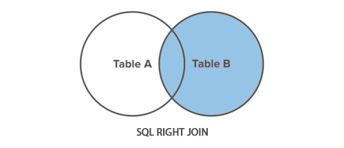

### <span style = "color:#6a9955"> RIGHT JOIN </span>
Um tipo de `OUTER JOIN`  
  

### <span style = "color:#6a9955"> Tabela de Funcionarios (employers) </span>  
|emp_id  | emp_name     | hire_date  | dept_id |
|--------|--------------|------------|---------|
|      1 | Ethan Hunt   | 2001-05-01 |       4 |
|      2 | Tony Montana | 2002-07-15 |       1 |
|      3 | Sarah Connor | 2005-10-18 |       5 |
|      4 | Rick Deckard | 2007-01-03 |       3 |
|      5 | Martin Blank | 2008-06-24 |    NULL |  

### <span style = "color:#6a9955"> Tabela de Departamentos (departments) </span>   
| dept_id | dept_name        |
|---------|------------------|
|       1 | Administration   |
|       2 | Customer Service |
|       3 | Finance          |
|       4 | Human Resources  |
|       5 | Sales            |  

Esse tipo de `OUTER JOIN` é o oposto do `LEFT OUTER JOIN`, ele vai retornar a tabela da direita (a chamada pelo `RIGHT OUTER JOIN`), independente dela ter par na tabela da esquerda (a chamada pelo `FROM`).

```sql
SELECT t1.emp_name, t1.hire_date, t2.dept_name
FROM employers AS t1
RIGHT JOIN departments AS t2
ON t1.dept_id = t2.dept_id ORDER BY t1.emp_id;
```
### <span style = "color:#6a9955"> Output Esperado: </span>
| emp_id | emp_name     | hire_date  | dept_name        |
|--------|--------------|------------|------------------|
|      2 | Tony Montana | 2002-07-15 | Administration   |
|   NULL | NULL         | NULL       | Customer Service |
|      4 | Rick Deckard | 2007-01-03 | Finance          |
|      1 | Ethan Hunt   | 2001-05-01 | Human Resources  |
|      3 | Sarah Connor | 2005-10-18 | Sales            |