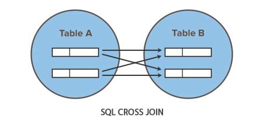

### <span style = "color:#6a9955"> CROSS JOIN </span>
  

### <span style = "color:#6a9955"> Tabela de Funcionarios (employers) </span>  
|emp_id  | emp_name     | hire_date  | dept_id |
|--------|--------------|------------|---------|
|      1 | Ethan Hunt   | 2001-05-01 |       4 |
|      2 | Tony Montana | 2002-07-15 |       1 |
|      3 | Sarah Connor | 2005-10-18 |       5 |
|      4 | Rick Deckard | 2007-01-03 |       3 |
|      5 | Martin Blank | 2008-06-24 |    NULL |  

### <span style = "color:#6a9955"> Tabela de Departamentos (departments) </span>   
| dept_id | dept_name        |
|---------|------------------|
|       1 | Administration   |
|       2 | Customer Service |
|       3 | Finance          |
|       4 | Human Resources  |
|       5 | Sales            | 

Esse tipo de `JOIN` vai combinar todas as linhas de uma tabela com todas as linhas da outra, ou seja, o numero de linhas retornadas vai ser igual a quantidade_de_linhas_tabela1 * quantidade_de_linhas_tabela2.

```sql
SELECT t1.emp_name, t1.hire_date, t2.dept_name
FROM employers AS t1
CROSS JOIN departments AS t2;
```


### <span style = "color:#6a9955"> Output Esperado: </span>
| emp_id | emp_name     | hire_date  | dept_name        |
|--------|--------------|------------|------------------|
|      1 | Ethan Hunt   | 2001-05-01 | Administration   |
|      2 | Tony Montana | 2002-07-15 | Administration   |
|      3 | Sarah Connor | 2005-10-18 | Administration   |
|      4 | Rick Deckard | 2007-01-03 | Administration   |
|      5 | Martin Blank | 2008-06-24 | Administration   |
|      1 | Ethan Hunt   | 2001-05-01 | Customer Service |
|      2 | Tony Montana | 2002-07-15 | Customer Service |
|      3 | Sarah Connor | 2005-10-18 | Customer Service |
|      4 | Rick Deckard | 2007-01-03 | Customer Service |
|      5 | Martin Blank | 2008-06-24 | Customer Service |
|      1 | Ethan Hunt   | 2001-05-01 | Finance          |
|      2 | Tony Montana | 2002-07-15 | Finance          |
|      3 | Sarah Connor | 2005-10-18 | Finance          |
|      4 | Rick Deckard | 2007-01-03 | Finance          |
|      5 | Martin Blank | 2008-06-24 | Finance          |
|      1 | Ethan Hunt   | 2001-05-01 | Human Resources  |
|      2 | Tony Montana | 2002-07-15 | Human Resources  |
|      3 | Sarah Connor | 2005-10-18 | Human Resources  |
|      4 | Rick Deckard | 2007-01-03 | Human Resources  |
|      5 | Martin Blank | 2008-06-24 | Human Resources  |
|      1 | Ethan Hunt   | 2001-05-01 | Sales            |
|      2 | Tony Montana | 2002-07-15 | Sales            |
|      3 | Sarah Connor | 2005-10-18 | Sales            |
|      4 | Rick Deckard | 2007-01-03 | Sales            |
|      5 | Martin Blank | 2008-06-24 | Sales            |